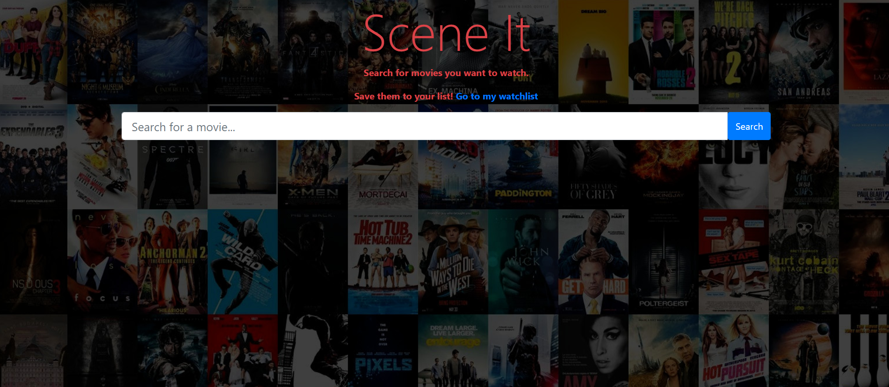
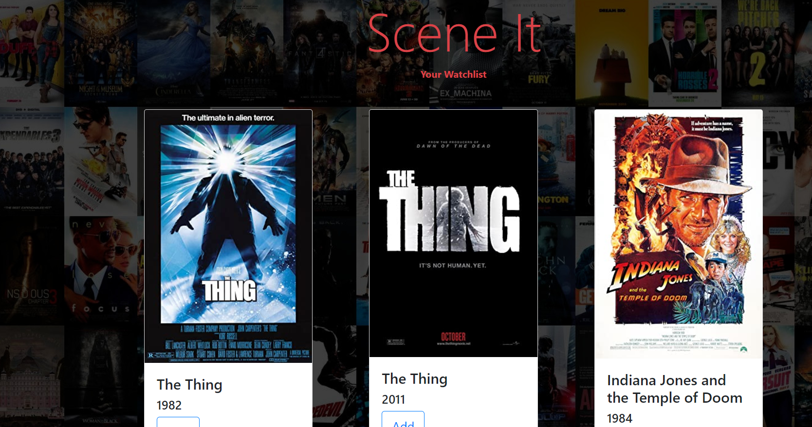

# scene-it

## Description 
The user can lookup movies and add them to a personal watchlist.  Movie data is pulled from OMDB's API.

## Future Possible Features
* Finish Remove from Watchlist feature
* Remove Add button from watchlist movies
* Adding more info on each movie such as runtime, ratings, director name, etc.
* Allowing users to share their watchlists with other users.
* Display if movie is currently available for streaming.